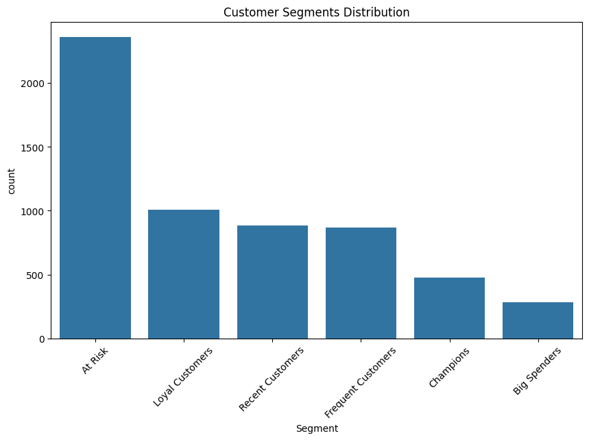

# RFM Customer Segmentation

## Overview
This project applies RFM (Recency, Frequency, Monetary) analysis to segment customers based on purchasing behavior. The goal is to identify high-value customers, detect churn risk, and provide data-driven strategies to improve retention and revenue.

## Dataset
The dataset consists of transactional retail data including customer IDs, invoices, product details, quantities, prices, and timestamps. The analysis focuses on transforming transaction-level data into customer-level insights.

## Dataset Source
This analysis uses the Online Retail dataset originally from the UCI Machine Learning Repository and accessed via Kaggle.

- UCI Source: https://archive.ics.uci.edu/ml/datasets/Online+Retail  
- Kaggle Version: https://www.kaggle.com/datasets/mashlyn/online-retail-ii-uci  

## Methodology
1. **Data Cleaning**
   - Removed records with missing Customer IDs (~243,000 records, ~23% of dataset)
   - Filtered out invalid transactions (negative quantity or price)
   - Converted date fields to datetime format

2. **Feature Engineering**
   - Created `TotalPrice = Quantity × Price`
   - Aggregated transactions at the customer level

3. **RFM Calculation**
   - Recency: Days since last purchase
   - Frequency: Number of transactions
   - Monetary: Total spending

4. **Scoring**
   - Each metric scored from 1–5 using quantiles
   - Recency scoring reversed (lower = better)
   - Combined into a 3-digit RFM score

5. **Segmentation**
   Customers grouped into:
   - Champions
   - Loyal Customers
   - Recent Customers
   - Frequent Customers
   - Big Spenders
   - At Risk

## Key Insights

- The **"At Risk" segment dominates (~40%)**, indicating a large portion of customers are disengaging  
- **High-value segments (Champions, Big Spenders) are limited**, suggesting revenue concentration among a small group  
- The distribution indicates **retention is a greater opportunity than acquisition**  
- Customer behavior is unevenly distributed, highlighting potential for targeted marketing strategies  

## Recommendations
- **At Risk:** Implement re-engagement campaigns (discounts, email reminders, personalized offers)  
- **Champions:** Retain with loyalty programs, early access, and premium incentives  
- **Frequent Customers:** Increase basket size through cross-selling and bundling  
- **Recent Customers:** Nurture engagement to convert into loyal customers  
- Prioritize **retention-driven strategies** over broad acquisition  

## Tools Used
Python, Pandas, NumPy, Matplotlib, Seaborn, Jupyter Notebook  

## Project Structure
rfm-customer-segmentation/  
├── rfm_analysis.ipynb  
├── segment_distribution.png  
└── README.md  

## Author
Taku Takahashi
